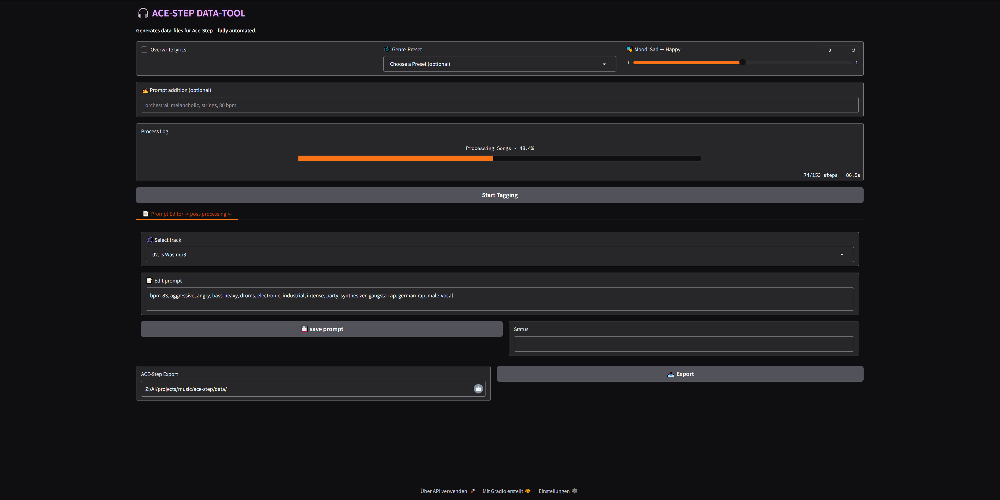

<h1 align="center">🎵 ACE-Step Data-Tool</h1>
<p align="center">
  <strong>Automated tool for building music datasets compatible with ACE-Step</strong><br>
  <em>Extracts lyrics, tags & BPM from audio files – fully local with Ollama & Gradio</em>
</p>

<p align="center">
  
  
  
  
  
</p>

<p align="center">
  
</p>


## ✨ Features

- 🎙️ **Lyric Detection** – automatically via Genius.com
- 🧠 **LLM-powered Tag Generator** (genre, mood, bpm, vocals, style)
- 🕺 **BPM Analysis** via Librosa
- 🖥️ **Modern WebUI** with mood slider, genre presets & custom prompt field
- 🗂️ **Export to ACE-Step training format**
- 🔁 **Retry logic & logging built-in**


## ⚙️ Installation

👉 Prefer German? [🇩🇪 Zur deutschen Anleitung](https://github.com/methmx83/ace-data_tool/blob/main/docs/README_de.md)

```bash
# 1. Clone the repository
git clone https://github.com/methmx83/ace-data_tool.git
cd ace-data_tool

# 2. Create Conda environment
conda create -n ace-data_env python=3.13 -y
conda activate ace-data_env

# 3. Install dependencies
pip install -e .

# 4. Download NLTK data (only once)
python -c "import nltk; nltk.download('vader_lexicon'); nltk.download('stopwords')"

# 5. Install Ollama & pull a model
ollama pull (your model)
```


## 🚀 Quickstart

```bash
# Launch the WebUI
ace-data
```

Then open: [http://localhost:7860](http://localhost:7860)

🎛️ In the interface:

* 🎵 Drop your MP3s in the `data/` folder  
* 🎭 Select genre preset or mood  
* 🧠 (Optional) enter a custom prompt  
* ✅ Click “Start Tagging”  
* → You'll get:
```
song.mp3
song_lyrics.txt   → Artist, title, full lyrics
song_prompt.txt   → Tags like: bpm-90, dark, 90s, male-vocal, boom-bap
```


## 💻 Recommended Setup

| Component | Recommended |
|-----------|-------------|
| OS        | Windows 10 Pro |
| GPU        |  8 GB VRAM |
| RAM       | 32 GB |
| Python    | 3.11 |
| CUDA      | 12.9 |
| Model     | `DeepSeek-R1-0528-Qwen3-8B-GGUF` via Ollama |

---

[Complete documentation - ]

---

## 📁 Project Structure

```
ace-data_tool/
├── webui/         → Gradio Interface
├── scripts/       → Lyrics, BPM, Tagging
├── include/       → Presets, Metadata, Prompt Tools
├── presets/       → Genre & mood presets
├── config/        → LLM model & API settings
└── data/          → Your music + generated metadata
```


## 🧩 Compatible with:

- ✅ [ACE-Step](https://github.com/ace-step/ACE-Step)
- ✅ LoRA-based training workflows
- ✅ All local Ollama models (Qwen, DeepSeek, LLaMA2 etc.)


## 📜 License

📝 Code licensed under [MIT License](LICENSE)  
🎼 Content (Lyrics, presets, screenshots) under [CC BY-NC 4.0](https://creativecommons.org/licenses/by-nc/4.0/)


*🎶 Generate clean, structured audio metadata in seconds – fully automated.*
